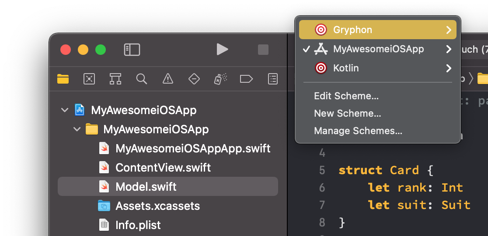
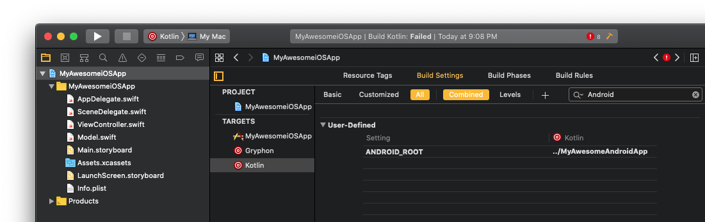

# Adding Gryphon to an existing app

This guide assumes a certain level of familiarity with the iOS and Android ecosystem. For a more beginner-friendly introduction, check out [Translating a new iOS app to Android](translatingANewiOSAppToAndroid.html). This guide also focuses on Xcode integration, which is only available on macOS; however, Linux and Docker users might still find important information here that they can use with the [command line interface](translatingCommandLinePrograms.html).

- [Setting up the project](addingGryphonToAnExistingApp.html#step-1-setting-up-the-project)
- [Adding the libraries](addingGryphonToAnExistingApp.html#step-2-adding-the-libraries)
- [Setting up the shared files](addingGryphonToAnExistingApp.html#step-3-setting-up-the-shared-files)
- [Adapting the shared files](addingGryphonToAnExistingApp.html#step-4-adapting-the-shared-files)
- [Building the Android app with Xcode](addingGryphonToAnExistingApp.html#step-5-building-the-android-app-with-xcode)

## Step 1: Setting up the project

Start by navigating to your iOS app's directory and running `gryphon init`:

```` bash
$ gryphon init myAwesomeiOSApp.xcodeproj/
````

It is important to do this in the folder that contains the Xcode project, otherwise the new Xcode targets might not work.

## Step 2: Adding the libraries

Gryphon uses two library files for its translations: one for the iOS app, and one for the Android app. You can generate them by running:

```` bash
$ gryphon generate-libraries
````

The two files will be created in the current directory. Add the `GryphonSwiftLibrary.swift` file to the iOS app by dragging it to Xcode, and add the `GryphonKotlinLibrary.kt` file to the Android app by dragging it to Android Studio.

Then, replace the placeholder `package` statement at the beginning of the `GryphonKotlinLibrary.kt` file with your app's package identifier.

```` kotlin
package com.example.myawesomeandroidapp
````

Make sure both files are being compiled in their respective apps - files translated with Gryphon will need access to their code.

## Step 3: Setting up the shared files

Start by selecting which of your app's files you want to translate. It's likely the selected files will need to be adapted to be used with Gryphon, so it's recommended you start with only a few files and increase their number gradually.

You can also choose to translate only some parts of a file by commenting declarations with `// gryphon ignore`:

```` swift
class MyClass { // gryphon ignore
	// ...
}
````

Any declarations marked with this comment will not be translated. This works for most supported declarations, such as extensions, protocols, functions, etc. Just make sure the comment is in the first line of the declaration. For more information, check out the [translation comments guide](translationComments.html).

Once you decide which files will be translated, add them to the new `gryphonInputFiles.xcfilelist` file, separated by newlines:

````
MyAwesomeiOSApp/SharedFile.swift
MyAwesomeiOSApp/AnotherSharedFile.swift
...

````

Now open each of these files and add a `// gryphon output:` comment saying where you want its Kotlin translation to be placed. Note that the paths should be relative to the location of the Xcode project, not the location of the files themselves.

````
// gryphon output: ../MyAwesomeAndroidApp/app/src/main/java/com/example/myawesomeandroidapp/SharedFile.kt
````

## Step 4: Adapting the shared files

Switch to the Gryphon target and hit build (**⌘+B**).



Gryphon wll probably raise some warnings. It's recommended that you fix these warnings, as they usually indicate potential bugs in the translations. If you have problems, try reading the guides on [translation comments](translationComments.html), [templates](templates.html) and [collections](collections.html) for more information.

A few tips to handle common warnings:

- **⚠️ Reference to standard library was not translated**: This usually refers to a standard library feature that's being used but that Gryphon doesn't yet know how to translate. Use a `// gryphon value` [translation comment](translationComments.html) or a [template](templates.html) to specify a translation manually.

- **⚠️ Native type Array/Dictionary can lead to different behavior in Kotlin**: Use `Lists` and `MutableLists` instead of Swift's `Arrays`, and use `Maps` and `MutableMaps` instead of Swift's `Dictionaries`. These classes have the same API as their Swift counterparts, but they're passed by reference, so they'll have the same behavior as the Kotlin translations. For more information, read the [collections guide](collections.html) or check out their implementation in the `GryphonSwiftLibrary.swift` file.

- **⚠️ If condition may have side effects**: Statements like "`if let foo = bar()`" can cause unintended side-effects in Kotlin. Use `// gryphon pure` comments when possible for functions that don't have side-effects. Otherwise, try refactoring the `if` statement in question into two nested `if` statements. You can read more details on this issue [in the documentation](translationComments.html#gryphon-pure).

- **⚠️ No support for mutable variables/mutating methods in value types**: Value types in Swift are translated as classes in Kotlin, which are passed by reference. This can lead to bugs when the value types have mutable members. You can try making the types immutable - that is, changing `var` to `let` and removing the `mutating` modifiers from functions. For `structs`, you can also try turning them into `classes`.

- **⚠️ Double optionals may behave differently in Kotlin**: Some Swift expressions can have types like `Int??`, with two (or more) optionals. These types are treated differently in Kotlin, which can lead to bugs. Try breaking up the expression into smaller parts to find the double optional if needed. Then, try using an `if let` or a `guard-let` to unwrap the optional before it gets doubled.

If you know the code is being translated correctly you can also [mute the warning](translationComments.html#gryphon-mute) with a `// gryphon mute` comment.

## Step 5: Building the Android app with Xcode

On Xcode, click on your Xcode project in the navigator, then click on the new `Kotlin` target. Open its `Build Settings` and search for a setting called `ANDROID_ROOT`. Change its value so that it points to your Android app's directory - specifically, the directory containing your `gradlew` file. This path should be relative to the location of the Xcode project.



Once that's done, you can switch to the Kotlin target and hit build (**⌘+B**). Xcode will compile your Android app and show any Kotlin warnings or errors in the Swift lines that originated them, so you can solve the issues at the source.


