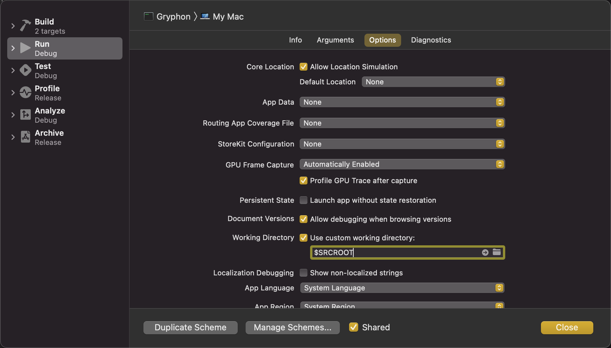
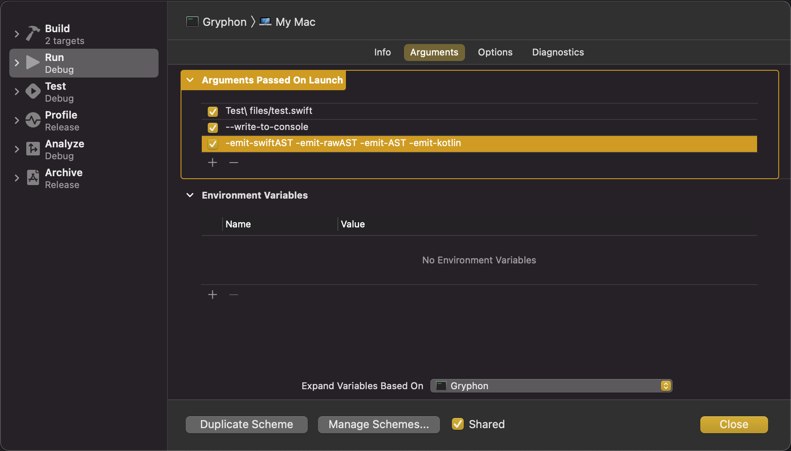
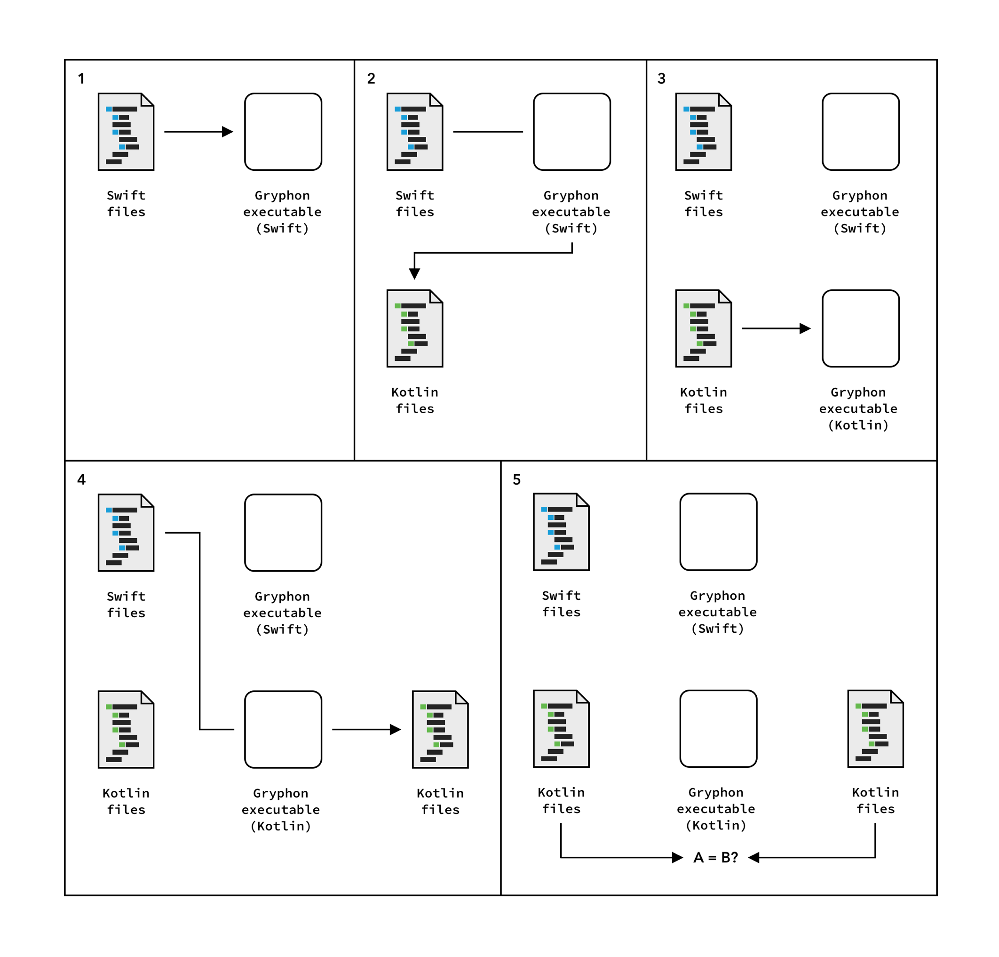
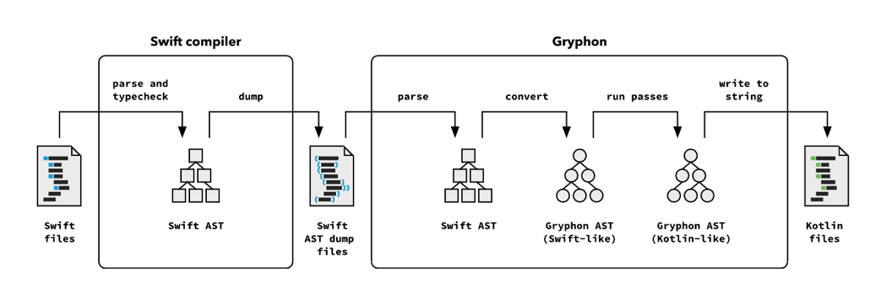
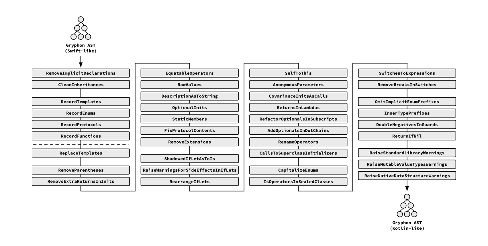

# Contributing

Contributions to Gryphon can take many forms, including sharing it with other developers, reporting bugs, and opening pull requests. The project aims to provide an open and inclusive space for everybody, which is why it abides to the [contributor covenant](https://www.contributor-covenant.org) and has a [code of conduct](https://github.com/vinivendra/Gryphon/blob/master/CODE_OF_CONDUCT.md).

- [Reporting bugs](contributing.html#reporting-bugs)
- [Contributing code](contributing.html#contributing-code)
	- [Running the tests](contributing.html#running-the-tests)
		- [Unit tests](contributing.html#unit-tests)
		- [Bootstrapping test](contributing.html#bootstrapping-test)
		- [Acceptance and Performance tests](contributing.html#acceptance-and-performance-tests)
		- [Additional Docker tests](contributing.html#additional-docker-tests)
	- [Style](contributing.html#style)
- [How Gryphon works](contributing.html#how-gryphon-works)

## Reporting bugs

Reporting bugs is an important part of contributing to any open source project. Many times, a bug hasn't yet been fixed simply because the maintainers do not know it exists. Gryphon uses [GitHub issues](https://github.com/vinivendra/Gryphon/issues) to keep track of bugs. Anyone is welcome to open new issues, so long as they are respectful and follow the [code of conduct](https://github.com/vinivendra/Gryphon/blob/master/CODE_OF_CONDUCT.md).

## Contributing code

### On macOS

Start by cloning the repository:

```` bash
$ git clone https://github.com/vinivendra/Gryphon.git
$ cd Gryphon
````

Gryphon is set up as a Swift package, so the Swift compiler can be used to generate an Xcode project for navigating the code:

```` bash
$ swift package generate-xcodeproj
$ open Gryphon.xcodeproj
````

Once the Xcode project is open, start by setting it to run in the current directory:

1. Hit **⌘+⇧+,** to open the scheme editor;
2. Select `Run` on the left-hand side, then `Options` on the top;
3. Scroll down to `Working Directory` and check `Use custom working directory`;
4. Set it to `$SRCROOT`, which is the Xcode project's directory.
    

Next, set a few arguments to use with the Gryphon executable:

1. Select `Arguments` on the top;
2. Add `test.swift` and `--write-to-console`
3. Optionally, add `-emit-swiftAST -emit-rawAST -emit-AST -emit-kotlin` as well to print the intermediate representations.
    
4. Close the scheme editor.

These arguments can be used to translate the `test.swift` file in the current directory. Add this file to the project so you can edit it and use it for testing your contributions:

1. Hit **⌘+⌥+A** to open the file selector;
2. Select the `test.swift` file;
3. Uncheck `Gryphon` in the `Add to targets:` section below;
4. Click `Add`.
    

Once all of that is configured, hit **⌘+R** to run Gryphon. You should see the Kotlin translation of the `test.swift` file show up in Xcode's console, along with other intermediate ASTs if you added the extra arguments.

### On Linux and Docker

Since Linux and Docker don't have access to Xcode, the setup is pretty much the same. Start by cloning the repository if you haven't done it yet:

```` bash
$ git clone https://github.com/vinivendra/Gryphon.git
$ cd Gryphon
````

Gryphon is set up as a Swift package, so most commands can be called using the Swift package manager. To build the main executable, run:

```` bash
$ swift build
````

Then execute it using:

```` bash
$ ./.build/<my_linux_identifier>/debug/Gryphon
````

A common invocation involves translating the `test.swift` file and printing its intermediate ASTs for debugging:

```` bash
$ ./.build/<my_os_identifier>/debug/Gryphon test.swift --write-to-console -emit-swiftAST -emit-rawAST -emit-AST -emit-kotlin
````

Tests can be executed using the following command:

```` bash
$ swift test
````

To run a specific test class, use the `--filter` option followed by a regular expression:

```` bash
$ swift test --filter IntegrationTest
````

## Running the tests

### Setup

The automated tests require Gryphon to be initialized in the current folder. To do that, run:

```` bash
$ swift build
$ ./.build/<my_os_identifier>/debug/Gryphon clean init -xcode
````

On macOS, Gryphon tests support for different Swift versions using available toolchains. Currently, it supports Swift 5.1 and 5.2. This will happen automatically if you have the toolchains installed. You can check their availability with:

```` bash
$ xcrun swift --version
Apple Swift version 5.2.2...

$ xcrun --toolchain "swift 5.1" swift --version
Apple Swift version 5.1...
````

If they're not available, you can download them on [swift.org](https://swift.org/download/#releases) under `Releases > Swift 5.x`.

If the toolchains aren't installed, a few of tests will fail in IntegrationTest and BootstrappingTest, but that is to be expected. Using toolchains to test different Swift versions is recommended but not required for contributing code.

### Unit tests

The Gryphon project contains several test classes. However, not all of them are meant to be executed every time - some have specific purposes, and some take too long. These tests can be removed from the normal unit tests suite to keep it fast so that it can be used often. They will be explained in the following sections.

#### On macOS:

1. On Xcode, hit **⌘+⇧+,** to bring up the scheme editor:
2. Select `Test` on the left-hand side, then `Info` on the top;
3. Click the small triangle on the left of `GryphonLibTests` to open the test list;
4. Uncheck the `AcceptanceTest`, the `BootstrappingTest` and the `PerformanceTest`;
5. Click close, then hit `**⌘+U**` to run the test suite.


#### On Linux and Docker:

1. Open the `Tests/GryphonLibTests/XCTestManifests.swift` file;
2. Make sure the `AcceptanceTest`, the `BootstrappingTest` and the `PerformanceTest` are commented;
3. Run `swift test` on the terminal to execute the test suite.

### Bootstrapping test

The bootstrapping tests are a way of testing Gryphon with more complicated code than the files in the `Test cases` folder. It consists of making Gryphon translate its own source code into Kotlin, then compiling the result and comparing it to the original Swift executable. This includes seeing if the Kotlin version produces the same output files for each test case, and checking that it passes the same unit tests.



The `prepareForBootstrapTests.sh` script is responsible for translating Gryphon's source code, compiling the translated code, and calling the translated executable to generate the necessary output files for comparison. It should be run before every execution of `BootstrappingTest`, since these tests need updated output files to work.

```` bash
$ bash prepareForBootstrapTests.sh
````

Once the script finishes:
- On macOS, open Xcode, hit **⌘+6** to open the tests navigator, right-click the `BootstrappintTest` and select `Run "BootstrappingTest"`.
- On Linux and Docker, uncomment the `BootstrappingTest` from the `XCTestManifests.swift` file, the run `swift test --filter Bootstrap`.

If any files were out of date (for instance, because the `prepareForBootstrapTests.sh` script wasn't executed), this test will raise an error.

Because the script takes a long time to finish, this test is typically only run before committing changes.

If the test starts raising unexpected errors, try resetting the environment:

1. Run `gryphon clean init -xcode`;
2. Run the unit tests, which will update the test cases;
3. Run `bash prepareForBootstrapTests.sh`;
4. Run only the `BootstrappingTest`.

### Acceptance and Performance tests

These two test classes should only be executed in specific situations.

Acceptance tests are used for making sure that the Kotlin translations of the Swift test cases in the `Test cases` folder work as expected. This is done by compiling the test cases, running them and checking if they produce the expected output (as recorded in the `.output` files). Run them whenever a `.kt` file in the `Test cases` folder is changed.

Performance tests are used only when working on a feature that may significantly impact performance. Run them before making your changes to get a baseline for you computer, then run them after the changes for comparison.

### Additional Docker tests

If you are using macOS, it is recommended to also run the tests in a Docker container to make sure they work on Linux. To do that, follow the instructions on [setting up the Docker container](installingGryphon.html#on-docker), then run any appropriate tests using the "on Linux and Docker" instructions above.

## Style

This project uses SwiftLint, a tool that automatically analyzes the code and sets it to the project's style standards. SwiftLint can be installed using [homebrew](https://brew.sh), or with other methods described in the [project's home page](https://github.com/realm/SwiftLint):

```` bash
$ brew install swiftlint
````

It can be used from the command line to automatically format all Swift source files according to the project's standard. Just run this command from the root directory of the repository:

```` bash
$ swiftlint autocorrect
````

Alternatively, you can run this command automatically with Xcode by adding it as a new Run Script Phase.

## How Gryphon works

This section gives a brief explanation on Gryphon's architecture, in the hopes of making it easier for contributors to understand it and start making changes.

Gryphon is almost entirely implemented as a library, `GryphonLib`. The `gryphon` executable consists of a `main.swift` file that imports this library and redirects the command-line arguments to it, printing errors if there are any.

The entry point for `GryphonLib` is the `Driver` class. This class is responsible for parsing the arguments and calling other classes to do the actual compilation work. The compilation is performed as a pipeline:



First, the `Driver` calls the Swift compiler to turn the Swift files into Swift AST dump files. Then, it calls Gryphon's `Compiler` class to perform the rest of the compilation. The `Compiler` internally delegates to other classes:

- the `ASTDumpDecoder` class *parses* the input test into a `SwiftAST`;
- the `SwiftTranslator` *converts* it to a workable "raw" Swift-like `GryphonAST`;
- the `TranspilationPass` *runs passes* on it, turning it into a "processed" Kotlin-like `GryphonAST`;
- and the `KotlinTranslator` *writes* it into Kotlin code.

Each of these steps receives its input along with other relevant information, most of which is stored in a `TranspilationContext`. They mostly deal with ASTs, or [Abstract Syntax Trees](https://en.wikipedia.org/wiki/Abstract_syntax_tree), a data structure that's very useful for representing code.

The compilation process starts with a Swift AST dump file. This is done because the AST dump is the only format emitted by the Swift compiler that contains all of the information needed by Gryphon to perform the translations. This is unfortunate because the AST dump is intended only for debugging the Swift compiler, and is not stable or even guaranteed to always exist. However, Gryphon needs the type information it provides for crucial parts of its translation process.

In simple cases, the AST dump is obtained by compiling the input files with `swiftc -dump-ast -output-file-map <output file map.json> <swift input files>`. The output file map is a JSON file that says where the AST dump for each input file should be written to. When using Xcode and iOS, this command gets significantly more complicated, and Gryphon tries to adapt Xcode's own swift compilation command to get the AST dumps.

Much of this process is done using files in the `.gryphon` folder. This folder is created whenever the user calls `gryphon init <xcode project>`. It is also created when calling `gryphon <input files>`, then deleted once the translation is done. It can be deleted with `gryphon clean`. This folder is used for containing any auxiliary files that Gryphon might need. This includes the output file map used for dumping Swift's ASTs, the Swift templates used for translating references to the standard library, scripts for dealing with Xcode projects and for mapping Kotlin errors to Swift, and several others.

The `AuxiliaryFileContents.swift` file contains the contents of these files. It also contains the contents of  the `GryphonSwiftLibrary.swift` and the `GryphonKotlinLibrary.kt` files that users add to their projects using `gryphon generate-libraries`. The contents of the library files should always match the strings in this file; there is a test in `DriverTest` that ensures this.

Most of the actual translation work happens in the several `TranspilationPass` classes. Each of these classes is responsible for performing a small part of the translation. There are many of them, as illustrated below, but they change often, so the image is probably already inaccurate.



Most of Gryphon's compilation is done in parallel for each input file. There is only one necessary point of synchronization, which is in the middle of the transpilation passes (specifically, the dotted line in the first column of the image above). This synchronization point is necessary because some transpilation passes need information from other files, which might not yet be available if the files are in threads that haven't been processed yet. The first few transpilation passes are responsible for recording this information on the shared `TranspilationContext` class. Once that has been done for all files, then the other transpilation passes can continue to work in each file in parallel again.

The `LibraryTranspilationPass.swift` file contains transpilation passes responsible for recording and applying [templates](templates.html) to the source files. These transpilation passes are larger than the others, so they're placed in a separate file so they don't clutter the main `TranspilationPass` file.

After all the transpilation passes have been executed, the resulting `GryphonAST` is handed to the  `KotlinTranslator` class. This class turns the `GryphonAST` into a `KotlinTranslationResult`. A `KotlinTranslationResult` is a finished Kotlin translation - all the strings are there, in the order thay'll be placed in the output file - but it still is structured as an AST. This allows the compiler to create error maps for each file before synthesizing the final code. Error maps are files that map each element in a Kotlin source file to the element in a Swift source file that originated it. Gryphon uses these maps to report Kotlin errors in their corresponding locations in the Swift source files.
